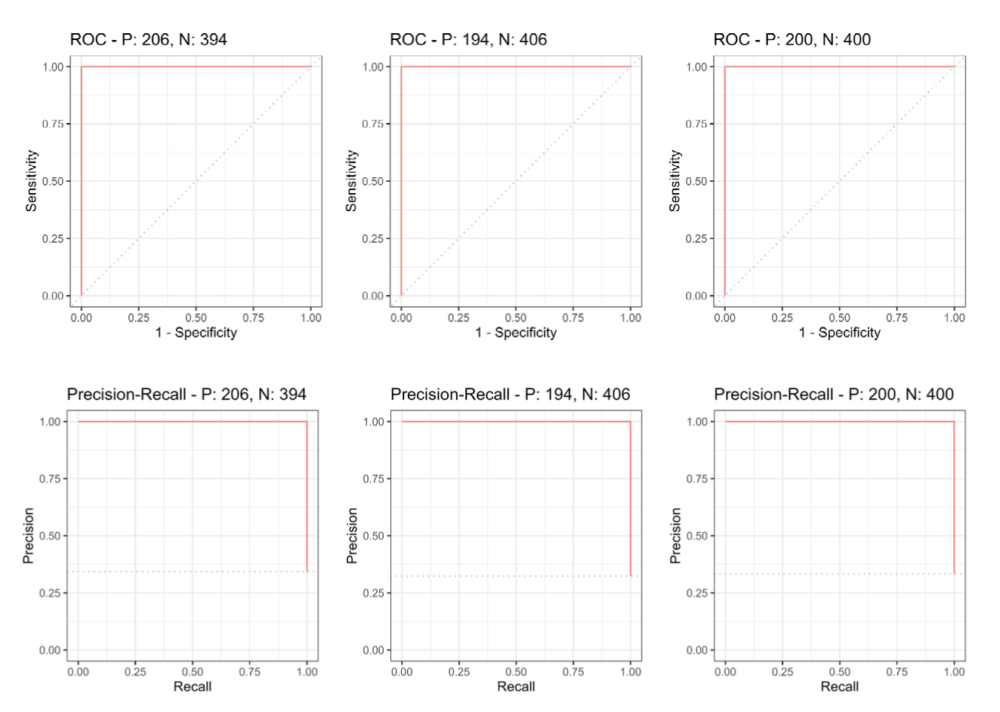
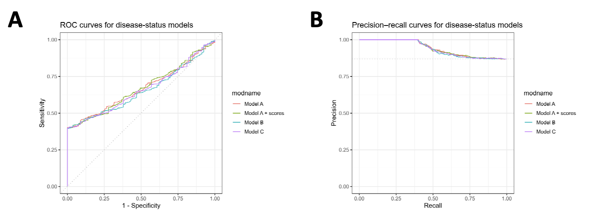

---
output: github_document
---

# microenvRF

本 R 包用于肿瘤微环境（Tumor Microenvironment）相关的分类预测，基于 Random Forest 训练模型提供：
- 细胞类型分类：Cancer / T_Cell / Fibroblast
- 疾病状态分类：Tumor vs Healthy_Control

> 注意：根据课程要求，分类函数返回 **class labels（标签）**，而不是概率。

## 1. 安装（GitHub）

```{r, eval=FALSE}
# install.packages("remotes")
remotes::install_github("YilongLi-xjtlu/microenvRF")
```

## 2. 快速使用示例（Usage demo）

### 2.1 安装后使用

```{r, eval=FALSE}
library(microenvRF)

example_path <- system.file("extdata", "example_input.csv", package = "microenvRF")
newdata <- read.csv(example_path)

predict_microenv(newdata, task = "cell_type")
predict_microenv(newdata, task = "disease_status")
```

### 2.2 开发态演示

```{r, eval=FALSE}
devtools::load_all()

example_path <- system.file("extdata", "example_input.csv", package = "microenvRF")
if (example_path == "") example_path <- file.path("inst", "extdata", "example_input.csv")
newdata <- read.csv(example_path)

predict_microenv(newdata, task = "cell_type")
predict_microenv(newdata, task = "disease_status")
```


## 3. 模型性能（Performance)

根据报告中的测试集评估结果，本项目展示两项任务的性能图示：

### 3.1 Cell type (Cancer / T_Cell / Fibroblast)


### 3.2 Disease status (Tumor vs Healthy_Control)

